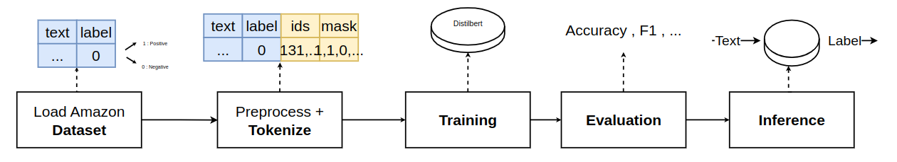

# CrossLingual_SentimentClassification

## Overview
This project focuses on **benchmarking and comparing sentiment analysis models** across different **languages** and **datasets**.  
The goal is to evaluate and understand the performance differences between **cross-lingual** and **monolingual** approaches in sentiment classification tasks.

We explore multiple datasets covering various linguistic domains and cultural contexts, aiming to identify how well pretrained language models generalize sentiment understanding beyond their training language.

## Experiments

### 1. Fine-Tuning using **Distilbert**

The core training script is located in [`sentiment_distilbert.py`](sentiment_distilbert.py).

In this file, we perform **fine-tuning** using:
- **Dataset:** Amazon Reviews (multi-domain sentiment dataset)  [(Dataset)](https://drive.google.com/file/d/1erK4WF-4dlzPIGkiDPDI8wbmWeK5DjKd/view)
- **Base Model:** `distilbert/distilbert-base-uncased` [(Model)](https://huggingface.co/distilbert/distilbert-base-uncased)

The fine-tuning process adapts the model for **sentiment polarity classification** (e.g., positive, neutral, negative) and evaluates its generalization across languages.

