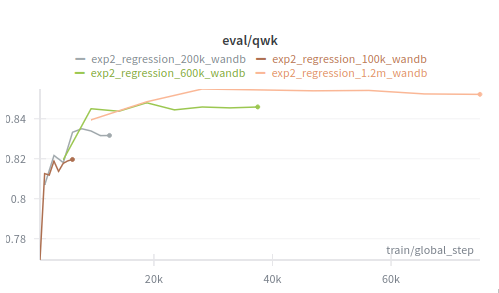
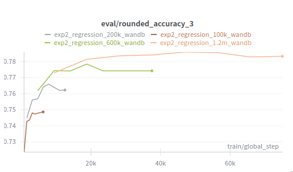
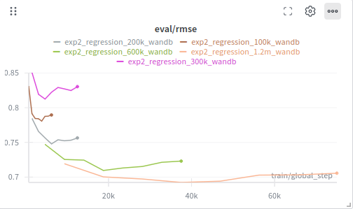
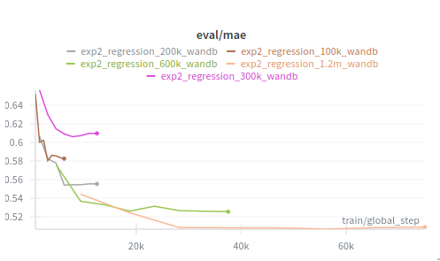
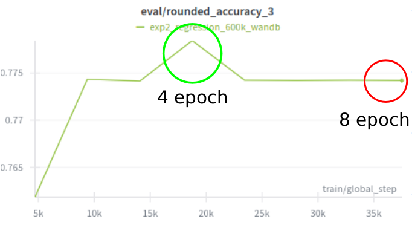
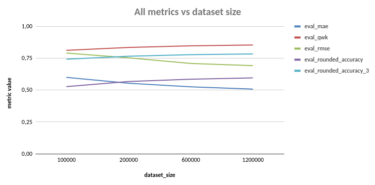

# Experiment2 – Regression-based Sentiment Prediction

## How to setup a run

1. Install Conda
   👉 [Conda official webpage](https://docs.conda.io/projects/conda/en/stable/user-guide/install/index.html)

   * [Linux installer](https://www.anaconda.com/docs/getting-started/miniconda/install#linux-terminal-installer)

2. Create the conda environment:

   ```bash
   conda env create -n NLP -f environment.yml
   ```

   *If you add new packages, remember to export again:*

   ```bash
   conda env export > environment.yml
   ```

3. Create a `.env` file with:

   ```bash
   DATASET_PATH=/path/to/amazon_reviews
   WANDB_API_KEY=your_wandb_key
   ```

---

## Experiments setup

### Dataset

The experiments were repeated four times using different **dataset sizes**: 100k, 200k, 600k, and 1.2M samples.

- **Dataset:** Amazon Reviews (multi-domain sentiment dataset)  [(Dataset)](https://www.kaggle.com/datasets/mexwell/amazon-reviews-multi/data)


### Model and task

* **Backbone:** `distilbert-base-multilingual-cased` [(Model card)](https://huggingface.co/distilbert-base-multilingual-cased)

* **Task:** **Regression**

  * The model predicts a **continuous sentiment score**.
  * Labels are normalized in `[0,1]` during training and mapped back to `[1,5]` at evaluation time.

This formulation explicitly exploits the **ordinal nature of star ratings**, unlike standard multiclass classification.

## Metrics

Both **regression** and **ordinal-aware** metrics are used:

### Regression metrics

* **MAE** (Mean Absolute Error)
* **RMSE** (Root Mean Squared Error)

### Ordinal / ranking metrics

* **Spearman correlation** (rank-based agreement)
* **Quadratic Weighted Kappa (QWK)**
  (penalizes large star-distance errors more than small ones)

### Classification-style diagnostics (derived)

* **Rounded Accuracy (5-class)**
  Exact match after rounding predictions to stars
* **Rounded Accuracy (3-class)**
  Negative / Neutral / Positive grouping

---

## Training configuration

Key hyperparameters:

* `learning_rate`: `2e-5`
* `num_train_epochs`: `8`
* `per_device_train_batch_size`: `32`
* `gradient_accumulation_steps`: `4`
  *(effective batch size = 128)*
* `per_device_eval_batch_size`: `128`
* `weight_decay`: `0.01`
* `lr_scheduler_type`: `cosine`
* `warmup_ratio`: `0.06`
* `max_grad_norm`: `1.0`

## Experiments results

The regression formulation leads to consistent improvements as the **dataset size increases**.
Notably, no performance plateau was observed across the explored scales: accuracy and ordinal metrics continued to improve up to the largest dataset considered.
This suggests that the optimal configuration is to leverage the full available dataset, as reducing the training size would result in a measurable loss in performance, with no evident opportunity to save computational cost without sacrificing accuracy.






* **RMSE** steadily decreases (≈ 0.79 → ≈ 0.69)
* **QWK** exceeds **0.85**, indicating strong ordinal agreement
* **Spearman correlation** ≈ **0.85**, showing robust rank consistency
* **3-class accuracy** approaches **78–79%**

Each model was trained for a maximum of 8 epochs; however, most runs achieved optimal validation performance after 4–5 epochs.
This observation is consistent with prior work showing that pretrained transformer models typically require only a small number of fine-tuning epochs, and that extended training may lead to overfitting or unstable optimization (Mosbach M. et al., On the Stability of Fine-Tuning BERT, ICLR 2021.).




These results confirm that the model learns **relative sentiment intensity**, not just coarse class boundaries.




